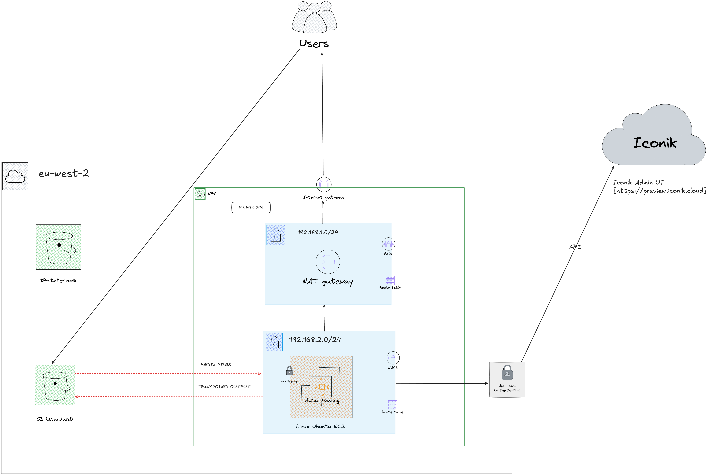

# AWS + iconik Transcoder Integration

This project provisions a secure and automated AWS infrastructure for integrating with the iconik Media Asset Management (MAM) system. It enables the upload of master content to an S3 bucket and automatically triggers the iconik edge transcoder to generate web proxies for seamless preview in the iconik Web UI.

## Features

- Private VPC with public subnet and internet access  
- Secure S3 bucket for master content ingestion  
- EC2 instance running iconik edge transcoder  
- IAM roles with scoped S3 access  
- AMI-compatible deployment  
- Modular and reusable Terraform setup

## Architecture



## Module Structure

- `modules/vpc`: Sets up VPC, subnet, route table, and internet gateway  
- `modules/s3_bucket`: Provisions versioned S3 bucket with encryption and bucket policy  
- `modules/ec2`: Launches EC2 with IAM profile, key pair, and security group  
- `modules/iam`: (Optional) IAM policy/role attachment  

## Requirements

- Terraform >= 1.4.0  
- AWS CLI with proper credentials  
- iconik portal access (for configuration)  
- iconik edge transcoder installer  

## How to Use

1. **Clone the Repo**
   ```bash
   git clone https://github.com/your-org/aws-iconik-transcoder.git
   cd aws-iconik-transcoder